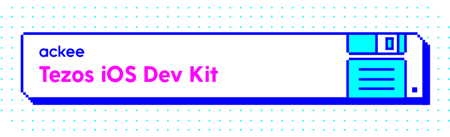

Tezos iOS dev kit is a set of tools made for better interaction with Tezos blockchain on iOS platforms.

## tezosgen

[tezosgen] is a smart contract code generator - you just specify the smart contract's specification and tezosgen generates type-safe `.swift` files, so using smart contracts in your iOS or Mac app has never been easier!

## TezosSwift

[TezosSwift] is a Swift library that is compatible with the [Tezos Blockchain](https://tezos.com). TezosSwift implements communication with the blockchain via the JSON API. The code also supports generating and calling smart contracts if you use our generator [tezosgen]

[tezosgen]: https://github.com/AckeeCZ/tezosgen
[TezosSwift]: https://github.com/AckeeCZ/TezosSwift